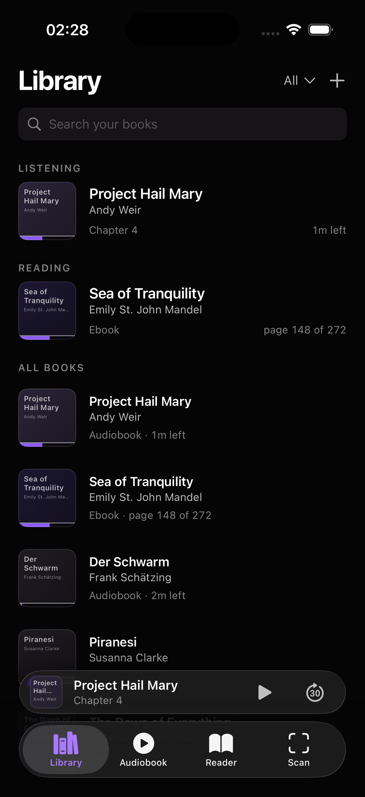
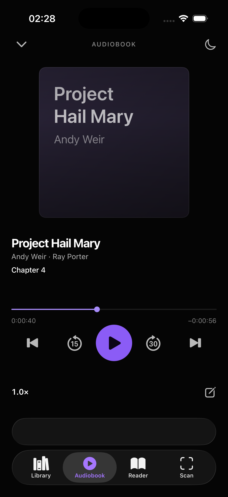
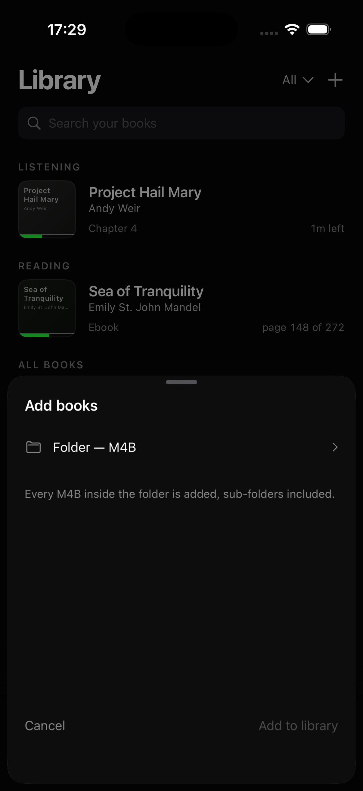

<div align="center">


# Listnr

**One book, three formats, one position.**

An iOS audiobook player that keeps paper, EPUB and audio on the same page —
and lets you scan a printed page with the camera to jump the audio to that spot.

</div>

---

## What it is

Listnr treats a book as one thing you own in up to three formats. It plays your own
DRM-free M4B files, captures notes stamped to the exact second, and (later) reads a photo of a
paper page with on-device OCR to move every format to that position.

Whispersync-style sync without Amazon. Everything runs on the device — no account, no backend.

| | |
|---|---|
| **Platform** | iOS 26+, Swift 6, SwiftUI, Liquid Glass `TabView` |
| **Storage** | SwiftData (CloudKit-ready) |
| **Audio** | AVFoundation, real chapters from asset metadata, background playback, lock-screen controls |
| **Import** | you pick a folder; the app indexes every M4B in it and rescans on launch |
| **OCR** | Vision, English + German (not built yet) |
| **Backend** | none |

## Status

<p align="left">
  
  
  
</p>

Working today:

- **Library** — live search, filter menu on the title row, Listening/Reading resume rows,
  progress as a band inside each cover's bottom edge.
- **Import** — "+" opens the folder picker; a security-scoped bookmark keeps the folder readable
  across launches and the indexer picks up files you add later.
- **Player** — scrimmed cover, chapter row, draggable three-time scrubber,
  prev/back-15/play/forward-30/next, speed to 2×, sleep timer, chapter wheel with selection haptic.
- **Mini-player** — the Liquid Glass tab-bar accessory on every tab except Audiobook, and only
  once a book is loaded.
- **Notes** — the pencil pauses audio, the sheet lists existing notes with jump-to-timestamp,
  saving resumes playback.
- **Background audio** — AVAudioSession + MPRemoteCommandCenter (verify on a real device).

Under construction: the **Reader** and **Scan** tabs show an under-construction screen and nothing
else. No dead controls anywhere.

## Run it

```bash
xcodegen generate          # after adding or removing files
open Listnr.xcodeproj      # iPhone 17 Pro simulator, then Cmd+R
```

`project.yml` is the project source of truth — never edit the `.xcodeproj` by hand.
Launch straight into a tab with the `-tab` argument (`library`, `audiobook`, `reader`, `scan`).

## Verify it

```bash
scripts/verify.sh          # grep gates + swiftlint + build + unit tests
scripts/verify.sh --no-tests
scripts/test.sh dev        # unit suite only
scripts/test.sh full       # unit + UI golden paths
scripts/evidence.sh        # boots the simulator and writes artifacts/*.png
scripts/make-icons.sh      # rasterizes the icon SVGs into the asset catalog
```

`verify.sh` fails the build on emoji in source, stray `print()`, `try!`, `fatalError`,
un-owned TODOs, and buttons without an accessibility label.

## Design

The mockups are the visual authority; written rules lose against them.

```bash
python3 -m http.server 8741 --directory docs/mockups
```

- `docs/mockups/library.html`, `audiobook.html`, `reader.html`, `scan.html` — the locked screens
- `docs/mockups/icon.html` — the ten app-icon concepts, scheme toggle at the bottom
- `docs/DESIGN.md` — the rules the mockups embody
- `docs/assets/icon/` — the icon master SVGs

Visual system: near-black `#050505`, white ink ramp, purple accent `#8B5CF6`, SF Pro only,
SF Mono for times. No badges, no explanatory caption strips. The app icon uses the same violet —
one accent everywhere.

## Layout

```
App/Sources/      Kit (engine, models, math) · Library · Player · Import · Store · Construction · Theme
App/Resources/    Assets.xcassets (app icon)
Fixtures/         generated sine-wave audio for the sample library
Tests/Unit  UI/   XCTest suites
docs/             DESIGN · PRODUCT · ARCHITECTURE · plans · reports · mockups · assets
artifacts/        simulator screenshots written by scripts/evidence.sh
scripts/          verify · test · evidence · make-fixtures · make-icons
project.yml       XcodeGen definition
```

## Documents

- [docs/PRODUCT.md](docs/PRODUCT.md) — product truth, scope, roadmap
- [docs/ARCHITECTURE.md](docs/ARCHITECTURE.md) — stack decisions and why
- [docs/DESIGN.md](docs/DESIGN.md) — the locked visual rules
- [docs/TESTFLIGHT.md](docs/TESTFLIGHT.md) — device and TestFlight steps
- [docs/TESTING.md](docs/TESTING.md) — what is tested and how
- [docs/IDEAS.md](docs/IDEAS.md) — parked ideas and dropped steps

## Content policy

The sample library ships with generated sine-wave audio and invented titles. No real book text,
audio, or artwork is bundled. Bring your own DRM-free files.
